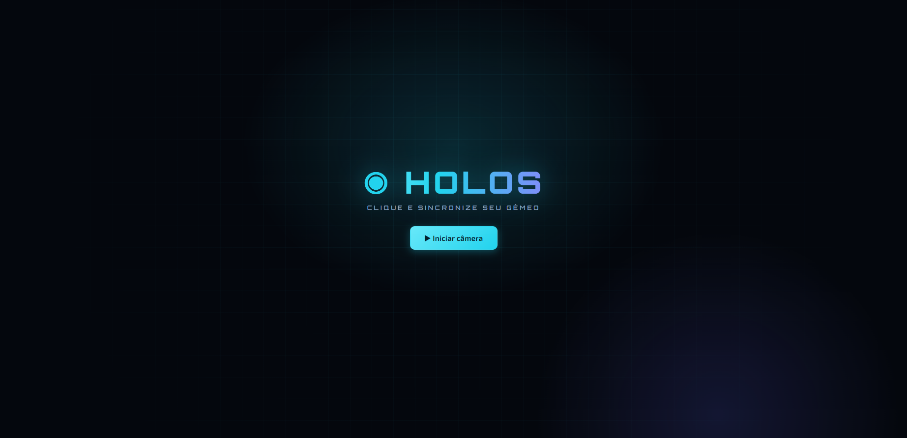
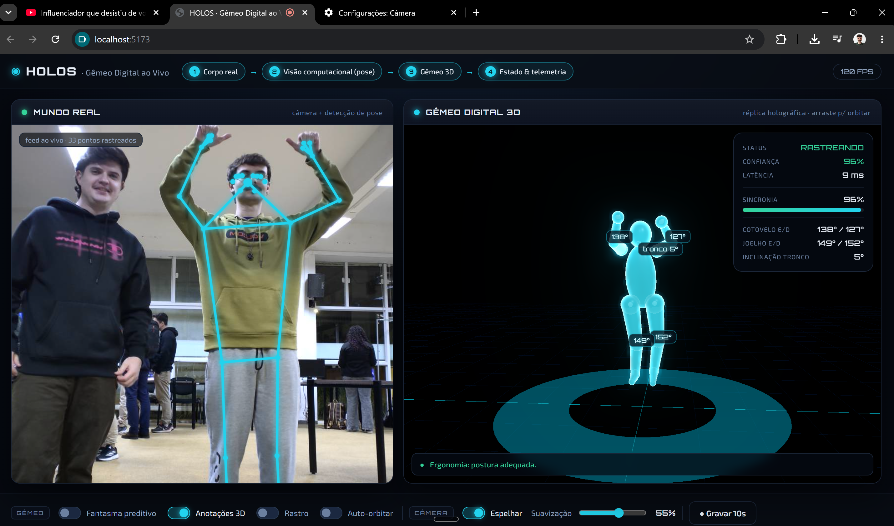

# HOLOS · Sombra Digital ao Vivo



Demo de **sombra digital** (*digital shadow*) em tempo real: a câmera do notebook é o
**sensor**, a visão computacional (MediaPipe Pose) extrai 33 articulações do corpo em 3D,
e um **avatar holográfico** (Three.js + bloom) reconstrói você em tempo real — orbitável
com o mouse. Tudo roda **localmente no navegador**, nada é enviado para a internet.



## Sombra digital, não gêmeo digital

O HOLOS é vendido em muitos contextos como "gêmeo digital", mas, pelo critério acadêmico,
ele é honestamente uma **Sombra Digital**. A diferença não está na qualidade do modelo 3D
— está em **como os dados fluem** entre o objeto físico e a cópia virtual.

Pela taxonomia de **Kritzinger et al. (2018)**, há três níveis:

| Nível | Fluxo de dados | O HOLOS? |
|------|----------------|----------|
| **Modelo Digital** | Sem troca automática — tudo manual. | — |
| **Sombra Digital** | Automático, mas de **uma via só**: físico → virtual. | ✅ **é aqui** |
| **Gêmeo Digital** | Automático e **bidirecional**: físico ⇄ virtual; o virtual também comanda o físico. | — |

O app traz uma explicação visual completa: clique em **"Por que isto é uma Sombra
Digital? →"** no topo da interface.

### Por que é sombra, e não gêmeo

O sistema faz coisas sofisticadas — **prevê movimento** (o "fantasma" extrapola para onde
você vai) e **analisa dados derivados** do modelo (ângulos, anomalias de postura). Mesmo
assim, faltam os dois ingredientes que definem um gêmeo:

- **Não existe caminho de volta.** Nada do que o virtual conclui atua automaticamente sobre
  o físico — a recomendação ("corrija a postura") só aparece na tela. É apoio à decisão,
  com um humano no meio.
- **A entidade virtual não tem simulação própria.** O avatar é um modelo *apenas
  geométrico/cinemático*: ele só espelha o físico em tempo real, não roda cenários "e se"
  nem prescreve/comanda.

> Em uma frase: **fluxo automático de uma via só + virtual sem simulação própria + sem laço
> de retorno = Sombra Digital.**

### Mapeando nas 5 dimensões (Tao et al., 2019)

| Dimensão | No HOLOS |
|----------|----------|
| **PE** — Entidade Física | O corpo da pessoa diante da câmera; a webcam é o sensor. |
| **VE** — Entidade Virtual | O esqueleto/avatar 3D reconstruído — modelo só geométrico/cinemático. |
| **Ss** — Serviços | Telemetria (ângulos de cotovelo/joelho, inclinação de tronco) e alarme ergonômico. |
| **DD** — Dados | Os 33 landmarks 3D por frame e o buffer de gravação/replay de 10 s. |
| **CN** — Conexões | **Aqui está o ponto:** a conexão é só físico → virtual. Nada desce de volta. |

### O que faltaria para virar um Gêmeo Digital

- **Fechar o laço bidirecional:** o virtual precisaria *comandar um atuador* no físico a
  partir da análise — ajustar sozinho a altura de uma cadeira/bancada, acionar um robô,
  enviar um comando de correção — de forma automática, sem depender de alguém lendo a tela.
- **Dar uma simulação própria à entidade virtual:** um modelo físico/comportamental capaz
  de prever e prescrever, e não apenas espelhar o que já aconteceu.

> **Nota de mercado:** isto não é um defeito. A maioria dos produtos vendidos hoje como
> "digital twin" são, na verdade, sombras digitais. O gêmeo digital pleno — bidirecional,
> com controle automático de volta ao físico — ainda é raro. Reconhecer onde um sistema
> está nessa escala é sinal de rigor, não de limitação.

## Como rodar

```bash
npm install          # dependências (Three.js + MediaPipe)
npm run fetch-model  # baixa o modelo de pose + runtime WASM para /public (uma vez, precisa de internet)
npm run dev          # abre em http://localhost:5173
```

Depois do `fetch-model`, a demo roda **offline**. Clique em **"Iniciar câmera"** e permita o acesso.

> A câmera só funciona em `localhost` ou HTTPS (requisito do navegador). O `npm run dev` já serve em `localhost`.

## Dicas de captura
- Fique a ~2 m da câmera, **corpo inteiro visível** e boa iluminação.
- `npm run build` gera a versão de produção em `dist/` (pode hospedar em qualquer HTTPS).

## Roteiro de apresentação (~90s)
1. **"Esquerda é o real, direita é a sombra digital."** Mexa os braços → o avatar 3D segue.
2. **Arraste o mouse** no painel direito para orbitar em volta do avatar enquanto se move
   → prova que é um modelo 3D de verdade, não vídeo. Ligue **Auto-orbitar** para deixar girando.
3. Aponte para a **telemetria** (ângulos, confiança, latência): *"a sombra não só te copia,
   ela deriva o seu estado."*
4. Ligue o **Rastro** e faça um movimento amplo → efeito visual forte.
5. Saia de quadro → **SINAL PERDIDO**; volte → ela re-sincroniza sozinha.
6. Abra **"Por que isto é uma Sombra Digital?"** → fecha a apresentação com o conceito:
   fluxo de dados de uma via só, sem laço de retorno ao físico.

## Stack
- **MediaPipe Tasks Vision** — Pose Landmarker (33 pontos, world landmarks 3D)
- **Three.js** — render 3D, `UnrealBloomPass` para o glow holográfico, `OrbitControls`
- **Vite** — dev server e build

## Estrutura
```
src/
  main.js       orquestra loop, telemetria, controles e o diálogo de explicação
  pose.js       carrega o MediaPipe Pose Landmarker
  twin3d.js     cena Three.js + avatar holográfico + bloom
  realview.js   overlay 2D do esqueleto sobre a webcam
scripts/
  fetch-model.mjs   baixa modelo + copia WASM para /public
```
